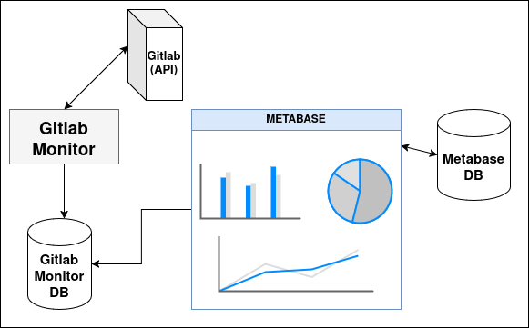

# Gitlab Monitor


## Overview

Gitlab Monitor is an open source project published by LINAGORA. This tool is used in conjunction with Gitlab to analyze and monitor the Gitlab instance in use.

The Gitlab Monitor v1.0.0 package is already available, allowing you to interact in a simplified way with the API of your Gitlab instance.

Gitlab Monitor works as follows, simplified interactions between the Gitlab API, your Gitlab Monitor database and a data visualization program called metabase, for which you use your own instance.



Gitlab Monitor offers several benefits :
- remove the projects you want, apply filters to specify your request (date filter, retrieve precise information such as commits)
- Save retrieved data to a database or JSON file as required
- Visualize your data and customize your dashboards via metabase software
- Store your queries in JSON files, which you can pass on as parameters for features such as project list archiving.


## Features
### v1.0.0
- scan-projects, command used to retrieve all projects from Gitlab
- scan-project [ID], command used to retrieve one project by knowing its ID
- options --commit and --no-database

## Documentation

See the entire Gitlab Monitor Documentation [here](TODO: add documentation website link).

## Installation

An easy installation of the application will be set up for version 2, for the moment you can refer to the [Installation Guide](TODO: add link).

## Contributing

Contributions are very welcome.
To learn more, see the [Contributor Guide](TODO: add link).

## License

Distributed under the terms of the [GPL v3 license](LICENSE),
_Gitlab Monitor_ is free and open source software.

## Issues

### 17 - Régler le problème d'accès distant à la base de donnée avec kubernetes
Afin de pouvoir accéder à la base donnée présent sur le pod k8s depuis l'exterieur une première solution (non sécurisé) peut être envisagé pour tester.
Créer un service NodePort qui ressemblerai à ça :
```yaml
apiVersion: v1
kind: Service
metadata:
  name: postgres-service
  namespace: default
spec:
  type: NodePort
  selector:
    app: postgres
  ports:
    - protocol: TCP
      port: 5432        # Port utilisé par PostgreSQL
      targetPort: 5432  # Port dans le conteneur
      nodePort: 30000   # Port exposé par Kubernetes (entre 30000 et 32767)
```
Ensuite il faut vérifier que la base de donnée accepte les connexions depuis l’extérieur en modifiant le fichier de config de postgres :
pg_hba.conf en y ajoutant les lignes suivantes :
- host all all 0.0.0.0/0 md5
- listen_addresses = '*'
Enfin pour s'y connecter depuis l'application python :
import psycopg2
Remplace par l'IP de ton nœud et le NodePort configuré
HOST = "192.168.1.100"  # IP du nœud Kubernetes
PORT = 30000            # NodePort exposé
DATABASE = "nom_de_ta_base"
USER = "ton_utilisateur"
PASSWORD = "ton_mot_de_passe"

### 8 - Mettre en place un outil de signalement de BUG et de demande d'évolution
A réfléchir. Eventuellement Discourse ?

### 7 - Création d'un site vitrine pour le projet
Créer un site vitrine pour le projet à destination du public :
Choix de technologie :
- pelican pour le backend (framework python léger)
- miligram pour le front (framework css)
Le site doit rester simple et rapide à modifier ainsi que respecter la charte graphique de Linagora

### 1 - Déploiement automatique k8s (force pull image)
Forcer le pull d'une image lors d'une mise à jour, sans avoir à redémarrer le déploiement k8s. Voir Deployment Strategy.

## Credits

Authors: Maïlys Jara, Flavien Perez

Copyright: Linagora 2024-2025

To contact the core contributors, see the [Contact section](TODO: add doc link) of the documentation.

## Links

[Read the docs](https://docs.readthedocs.com/platform/stable/)

[pre-commit](https://github.com/pre-commit/pre-commit)

[black](https://github.com/psf/black)