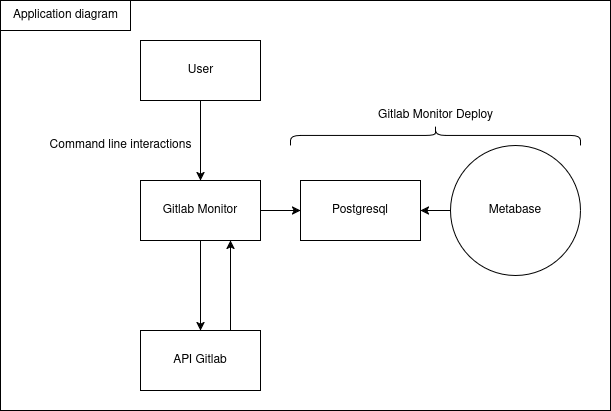
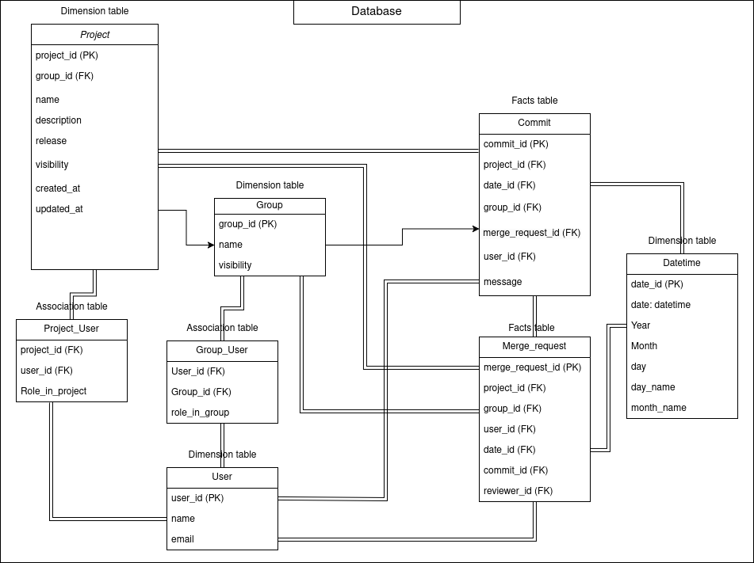

# Architecture

## Application

The project documentation covers the development part and the use of this application, as shown here. The Gitlab Monitor Deploy project documentation covers the deployment and the set up of the application.

## Database

The following uml diagram shows what the database might look like as the project evolves. For the moment, v1.0.0 only has the ***Project*** and ***Commit*** tables.

