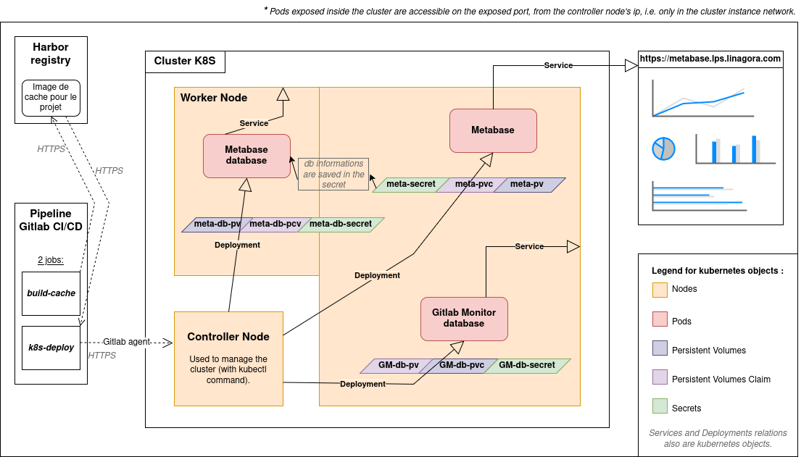

# Installation

## Download the package

### Using pipx

We recommend to use pipx so that you can use the application without having to worry about being in the manually created virtual environment. However, pipx doesn't seem to work on ubuntu versions prior to 23.04. To use pipx, please refer to its [documentation](https://pipx.pypa.io/stable/getting-started/).

### Using pip

You can install the GitLab Monitor package in a virtual environment where you can directly use the application. Pip can be used on several operating systems, and their [documentation](https://pip.pypa.io/en/stable/installation/) is rich and clear if you don't use the same operating system as we do.

On a linux system, follow these steps:
- Download the latest version of the wheel package (TODO: Add the link to the package on GitHub & GitLab)
- Create a virtual environment:
```bash
python -m venv venv_name
```
- Activate the virtual environment:
```bash
source venv_name/bin/activate
```
- Install the package:
```bash
pip install package.whl
```
(Replace package.whl with the downloaded package name.)
- Verify that the package has been installed:
```bash
python -m gitlab_monitor -v
```
- Create a file named .env: Follow the instructions in the *"How to connect our GitLab instance?"* tutorial.
- Start using the services provided by GitLab Monitor!

## Set Up the environment

To use Gitlab Monitor in its entirety, you need to deploy two instances: a postgresql database and a metabase instance. You're free to use the method that best suits your situation. However, here's an example.

You can also use the package without the followings deployments but without saving informations in the database and without graphic data visualization.

### Using Docker compose

- Install the latest version of docker by referring to its [documentation](https://docs.docker.com/engine/install/).
- Copy this file named 'docker-compose.yml', no matter which repertory.

```yaml
version: '3.9'

services:
  gitlab-monitor-db:
    image: postgres:14
    container_name: gitlab-monitor-db
    hostname: gitlab-monitor-db
    ports:
      - "5432:5432"
    environment:
      - POSTGRES_DB=${POSTGRES_DB}
      - POSTGRES_USER=${POSTGRES_USER}
      - POSTGRES_PASSWORD=${POSTGRES_PASSWORD}
    volumes:
      - gitlab-monitor-db-data:/var/lib/postgresql/data

  metabase-db:
    image: postgres:14
    container_name: metabase-db
    hostname: metabase-db
    ports:
      - "5434:5432"
    environment:
      - METABASE_DB=${METABASE_DB}
      - METABASE_DB_USER=${METABASE_DB_USER}
      - METABASE_DB_PASSWORD=${METABASE_DB_PASSWORD}
    volumes:
      - metabase-db-data:/var/lib/postgresql/data

  metabase:
    image: metabase/metabase:latest
    container_name: metabase
    hostname: metabase
    ports:
      - "3000:3000"
    environment:
      - MB_DB_TYPE=${MB_DB_TYPE}
      - MB_DB_PORT=${MB_DB_PORT}
      - MB_DB_HOST=${MB_DB_HOST}
      - MB_DB_NAME=${METABASE_DB}
      - MB_DB_USER=${METABASE_DB_USER}
      - MB_DB_PASSWORD=${METABASE_DB_PASSWORD}
    volumes:
      - metabase-data:/metabase-data
    depends_on:
      - metabase-db

volumes:
  gitlab-monitor-db-data:
  metabase-db-data:
  metabase-data:
```

- Set the environments variables : Copy this file named '.env'.These are the environment variables used in docker compose. Customize their values (especially passwords).
```bash
POSTGRES_DB=gitlab-monitor-db
POSTGRES_USER=gitlab-monitor-user
POSTGRES_PASSWORD=gitlab-monitor-password

METABASE_DB=metabase-db
METABASE_DB_USER=metabase-user
METABASE_DB_PASSWORD=metabase-password

MB_DB_TYPE=postgres
MB_DB_PORT=5432
MB_DB_HOST=metabase-db
```

- Deploy with the command :
```bash
docker compose up -d
```
- Check that your containers are running :
```bash
docker ps
```
- If this is not the case, debug with the following commands:
```bash
docker ps -a
```
This command list of containers that have been started but are not running.
```bash
docker logs [CONTAINER_ID]
```
View the logs of the container that’s not running and find out why.

- When you’ve finished, you can shutdown the running containers by using :
```bash
docker compose down
```

- Once the instances have been deployed, add the environment variables used by Gitlab Monitor to connect our instances in the '.env' file as described in the [Tutorials](tutorials.md) section. DB_HOST will be ‘localhost’ and DB_PORT ‘5432’. To connect your metabase instance, connect to the folowwing url : http://localhost:3000/


### Using Kubernetes

At linagora these instances have been permanently deployed on the company's Kubernetes cluster. If you have a Kubernetes cluster, you can use the following architecture for your deployments:
